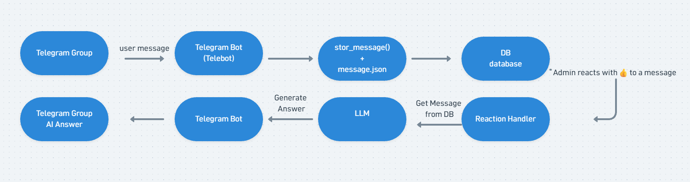

# Telegram AI Assistant

A Python-based Telegram bot that receives and stores users’ messages. After an administrator approves a message using a 👍 Reaction, the bot sends the message to a local language model (Local LLM), generates a response, and sends the generated response back to Telegram.

---

## Architecture

the project consists of three parts:

- Telegram Bot
- Database
- Local LLM

Work Flow:



## Technology used

- Python
- PyTelegramBotAPI (Telebot)
- Ollama
- TinyDB
- python-dotenv

---

## Ollama Setup

Run the following commands in the terminal step by step.

### 1. Install Ollama
```bash
ollama install
```
### 2. Check Ollama version
```bash
ollama --version
```
### 3. Download the required model
```bash
ollama pull gemma3:12b   
```
### 4. Check installed models
```bash
ollama list
```
### 5. Run the model
```bash
ollama run orca-mini
```

## Structure

```text
project/
│
├── src/
│   ├── bot.py
│   ├── llm.py
│   ├── db.py
│   ├── messages.py
│   └── ...
│
|── images
|   |──bot.png.png
├── .env
├── message_db.json
└── README.md